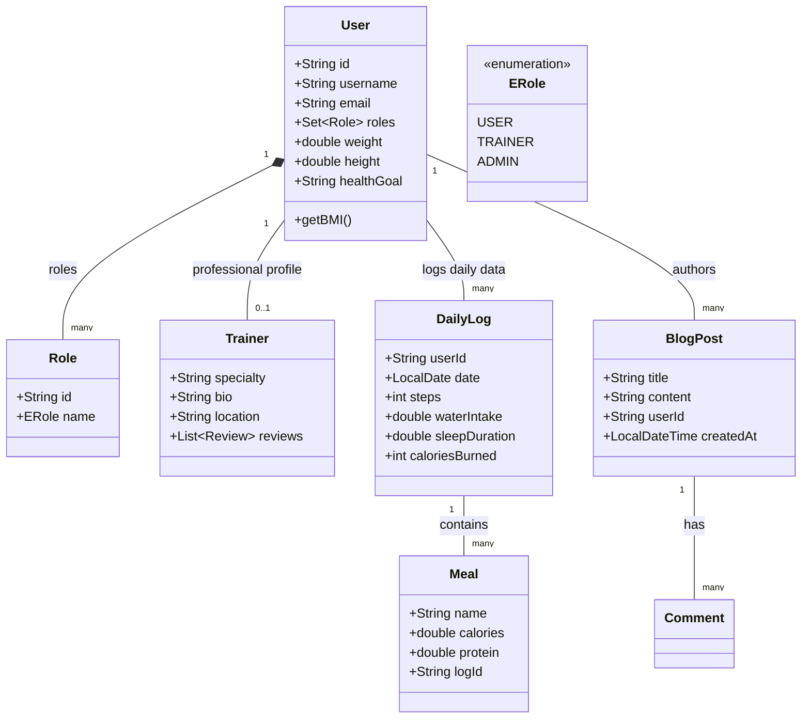
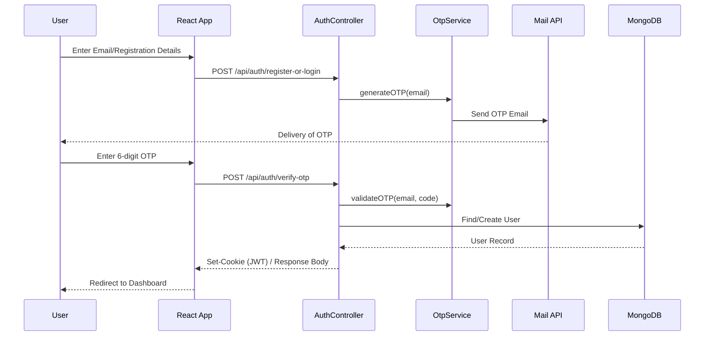
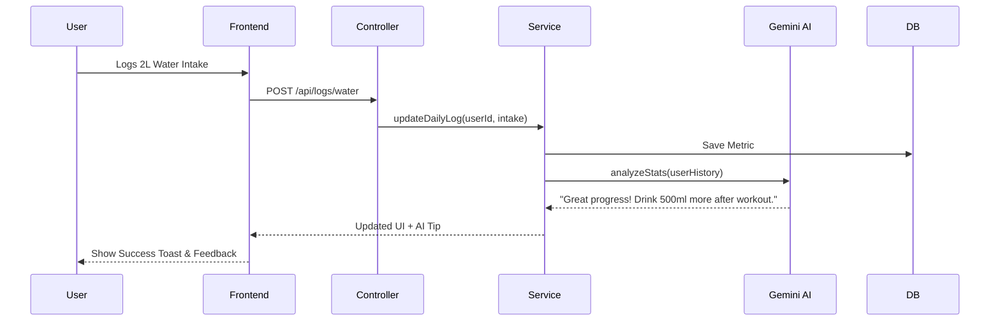
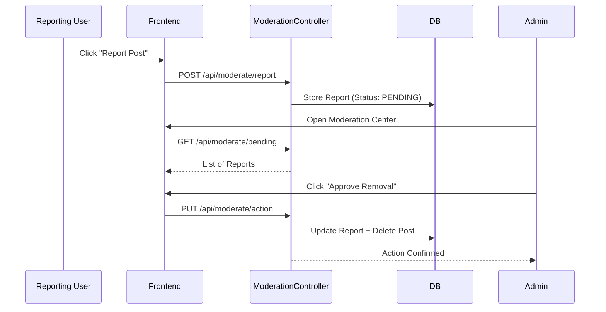

# HealthMate Project Diagrams

This document contains architectural and procedural diagrams for the HealthMate application, represented in **Mermaid** syntax.

## 1. Use Case Diagram
Visualizes the primary interactions between different actors and the system functionalities.

```mermaid
usecaseDiagram
    actor "User" as U
    actor "Trainer" as T
    actor "Admin" as A
    actor "AI Engine" as AI

    package "HealthMate System" {
        usecase "Login / Register (OTP)" as UC1
        usecase "Track Daily Metrics (Steps, Water, Sleep)" as UC2
        usecase "Log Meals & Workouts" as UC3
        usecase "Post & Comment on Blogs" as UC4
        usecase "Follow/Unfollow Community Members" as UC5
        usecase "Search & Hire Trainers" as UC6
        usecase "Receive AI Health Tips" as UC7
        usecase "Generate Personalized Plans" as UC8
        usecase "Moderate Content & Reports" as UC9
    }

    U --> UC1
    U --> UC2
    U --> UC3
    U --> UC4
    U --> UC5
    U --> UC6
    U --> UC8
    
    T --> UC1
    T --> UC4
    T --> UC6
    
    A --> UC1
    A --> UC9
    
    AI --> UC7
    AI --> UC8
    UC2 ..> UC7 : <<include>>
```

---

## 2. Class Diagram
Represents the structural model and data relationships of the backend.



---

## 3. Sequence Diagrams
Dynamic behavioral charts for core workflows.

### A. Authentication Flow (OTP-Based)
How a user logs into the system securely.



### B. Activity Tracking & AI Tip Generation
How logging a metric triggers system feedback.



### C. Moderation Workflow
Handling reports for inappropriate content.



---

## Technical Implementation Details
- **Persistence**: MongoDB (NoSQL) using `Spring Data MongoDB`.
- **Security**: JWT-based authentication with OTP secondary verification.
- **Frontend**: React.js with styled-components/Lucide icons.
- **AI Integration**: Google Gemini API for health tip generation and data analysis.
