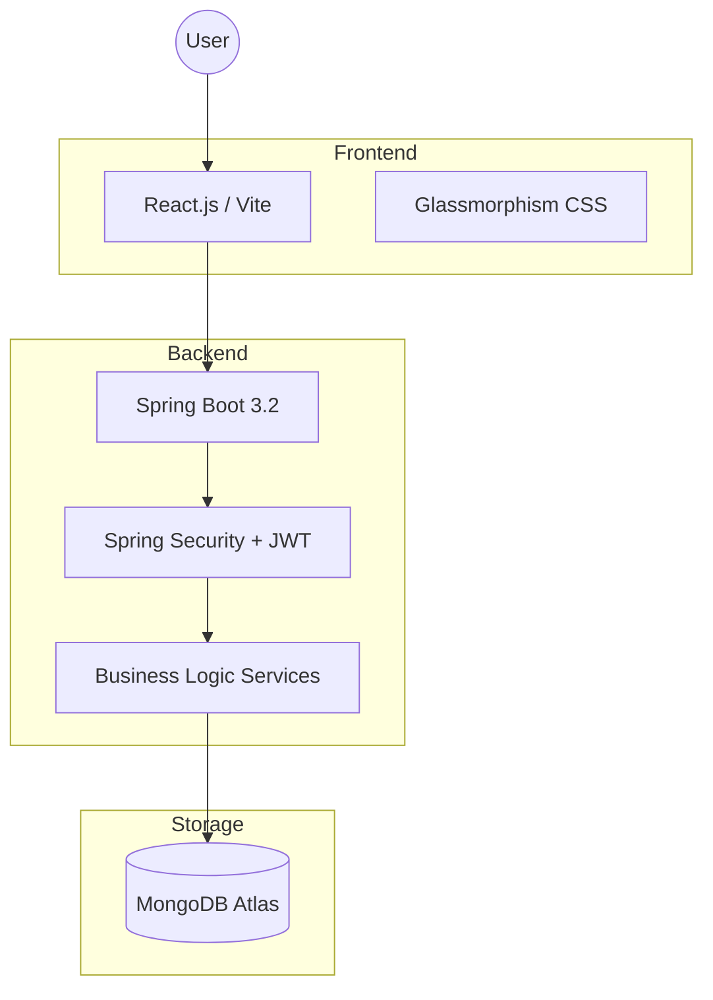
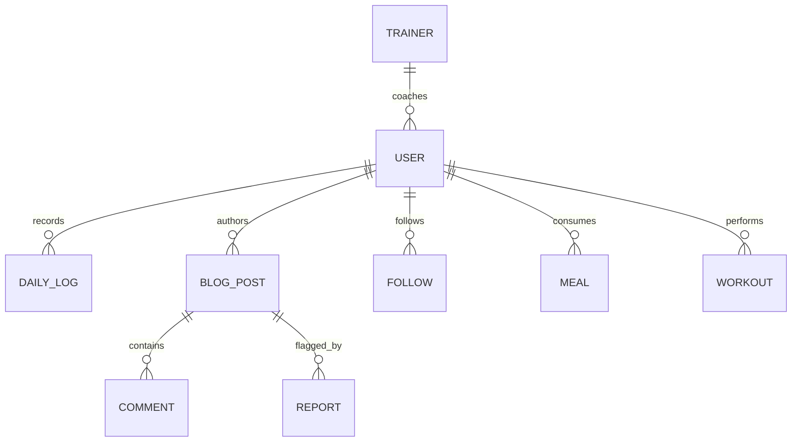

# HealthMate: Comprehensive System Documentation


## Table of Contents
1. [Chapter 1: Executive Summary & Vision](#chapter-1-executive-summary--vision)
2. [Chapter 2: System Architecture & Tech Stack](#chapter-2-system-architecture--tech-stack)
3. [Chapter 3: Backend Technical Reference](#chapter-3-backend-technical-reference)
4. [Chapter 4: Frontend Technical Reference](#chapter-4-frontend-technical-reference)
5. [Chapter 5: Database Schema & Data Models](#chapter-5-database-schema--data-models)
6. [Chapter 6: Core Features & Algorithms](#chapter-6-core-features--algorithms)
7. [Chapter 7: Security & Authentication](#chapter-7-security--authentication)
8. [Chapter 8: User Manual](#chapter-8-user-manual)
9. [Chapter 9: Installation & Deployment](#chapter-9-installation--deployment)
10. [Chapter 10: Future Roadmap & Conclusion](#chapter-10-future-roadmap--conclusion)

---

## Chapter 1: Executive Summary & Vision

### 1.1 Project Mission
HealthMate is designed as a holistic health and fitness ecosystem that bridge the gap between data logging and actionable insights. Our mission is to empower individuals to take control of their physical well-being through a seamless, AI-enhanced platform that tracks nutrition, exercise, and vital signs in one unified interface.

### 1.2 The Problem
In today's digital age, health data is often fragmented. Users use one app for calorie counting, another for workout tracking, and yet another for community support. This fragmentation leads to:
- **Data Silos**: Inability to see how nutrition affects workout performance.
- **Cognitive Overload**: Managing multiple subscriptions and interfaces.
- **Lack of Personalization**: Generic advice that doesn't account for specific physiological metrics.

### 1.3 The HealthMate Solution
HealthMate solves these issues by providing a **Unified Health Dashboard**. Key value propositions include:
- **Interconnected Tracking**: Automatically correlates meal intake with exercise output.
- **AI Guidance**: A built-in "HealthMate AI" that provides real-time navigation and health advice.
- **Professional Integration**: Connects users directly with certified trainers.
- **Community Engagement**: A robust blog and social system to share journeys.

---

## Chapter 2: System Architecture & Tech Stack

### 2.1 High-Level Architecture
HealthMate follows a decoupled **Client-Server Architecture** ensuring scalability and ease of maintenance.



### 2.2 Technology Stack
| Layer | Technology | Rationale |
| :--- | :--- | :--- |
| **Frontend** | React 18 | For building a dynamic, component-based UI. |
| **Build Tool** | Vite | Faster development and optimized production builds. |
| **Backend** | Spring Boot 3 | Industry-standard stability and robust ecosystem. |
| **Security** | JWT (JSON Web Tokens) | Secure, stateless authentication for REST APIs. |
| **Database** | MongoDB | Document-oriented storage for flexible health logs and post data. |
| **Icons** | Lucide React | Premium, lightweight vector icons. |

---

## Chapter 3: Backend Technical Reference

### 3.1 Domain Models (Data Layer)
The backend defines 15 core entities representing the domain logic.

#### `User.java`
The central model for all actors.
- **Fields**: `username`, `email`, `password`, `age`, `height`, `weight`, `activityLevel`, `healthGoal`.
- **Relationships**: Linked to `Role` (Many-to-Many).

#### `DailyLog.java`
Stores temporal health telemetry.
- **Fields**: `date`, `weight`, `caloriesBurned`, `waterIntake`, `sleepDuration`, `steps`, `distance`.
- **Usage**: Used for analytics and progress charting.

#### `BlogPost.java`
Enables community sharing.
- **Fields**: `title`, `content`, `authorId`, `likes`, `tags`, `imageUrl`.

### 3.2 API Documentation (Controller Layer)

#### 1. Authentication Controller (`/api/auth`)
Handles the entire user lifecycle and account recovery.
- `GET /check-username`: Verifies if a username is available.
- `POST /signin`: Authenticates user and returns a JWT.
- `POST /signup`: Provisions new user accounts with encrypted passwords.
- `POST /forgot-password`: Initiates OTP-based password recovery.

#### 2. Analytics Controller (`/api/analytics`)
Data-heavy endpoints for dashboard visualization.
- `GET /history`: Returns chronological health logs.
- `GET /streak`: Calculates consecutive logging days.
- `GET /dashboard`: Aggregates today's summary, weekly activity, and goal progress.

#### 3. Blog Controller (`/api/blog`)
Manages the community content engine.
- `GET /posts`: Paginated feed of health stories.
- `POST /create`: Allows users/trainers to publish content.
- `PATCH /like`: Atomic increment for post engagement.

---

## Chapter 4: Frontend Technical Reference

### 4.1 Component Architecture
HealthMate uses a modular component structure designed for performance and reusability.

#### 1. Activity Heatmap (`ActivityHeatmap.jsx`)
One of the most complex UI components in the system, it provides a GitHub-style activity grid over 365 days.
- **Logic**:
  - Aligns start date to the nearest Sunday to maintain a consistent 7-row grid.
  - Groups linear data into columns (weeks).
  - Uses `useMemo` for heavy computation of streaks and submission counts.
- **Styling**: Theme-aware colors that scale from light green to deep emerald based on user steps.

#### 2. Chatbot Interface (`Chatbot.jsx`)
A global overlay component providing an interface with HealthMate AI.
- **Features**: Bubble-style message bubbles, typing indicators, and auto-scroll logic.

### 4.2 Page Breakdown
| Page | Route | Description |
| :--- | :--- | :--- |
| **Dashboard** | `/` | Central hub for all health metrics and active insights. |
| **Meal Tracker** | `/meal-tracker` | Studio for logging food intake and getting AI-generated nutrition plans. |
| **Workout Tracker** | `/workout-tracker` | Interface for recording strength, cardio, and yoga sessions. |
| **Blog Studio** | `/blog` | Community feed for reading and creating health-related articles. |
| **Moderation Center** | `/moderation` | Admin suite for managing reports and reviewing pending content. |
| **Trainer Match** | `/find-trainer` | Marketplace for connecting with professional health coaches. |

---

## Chapter 5: Database Schema & Data Models

### 5.1 MongoDB Collection Specifications

#### Collection: `users`
| Field | Type | Description |
| :--- | :--- | :--- |
| `username` | String | Unique identifier used for login. |
| `email` | String | Verified email address for recovery. |
| `password` | String | BCrypt hashed password string. |
| `age` | Integer | Used for calorie target calculations. |
| `weight` | Double | Current weight in Kilograms. |
| `healthGoal` | Enum | [WEIGHT_LOSS, MUSCLE_GAIN, MAINTENANCE] |

#### Collection: `daily_logs`
| Field | Type | Description |
| :--- | :--- | :--- |
| `userId` | ObjectId | Reference to the user owner. |
| `date` | Date | The log entry timestamp. |
| `steps` | Integer | Total step count for the day. |
| `caloriesBurned` | Integer | Sum of basal metabolic rate + active burn. |

### 5.2 Entity Relationship Diagram (ERD)



---

## Chapter 6: Core Features & Algorithms

### 6.1 Personalized AI Suggestions
HealthMate generates personalized nutrition targets using the Harris-Benedict Equation (modified) and Mufflin-St Jeor formula inside the `HealthPlanService`.

**Formula for Basal Metabolic Rate (BMR):**
- **Male**: $BMR = (10 \times weight) + (6.25 \times height) - (5 \times age) + 5$
- **Female**: $BMR = (10 \times weight) + (6.25 \times height) - (5 \times age) - 161$

**TDEE (Total Daily Energy Expenditure):**
Calculated by multiplying BMR by an Activity Factor:
- Sedentary: $1.2$
- Light: $1.375$
- Very Active: $1.725$

### 6.2 The Streak Logic
Streaks are calculated in the `AnalyticsController` by checking chronological gaps between consecutive logs. A gap of $>24$ hours from the last entry resets the streak to zero, encouraging consistent daily engagement.

---

## Chapter 7: Security & Authentication

### 7.1 The JWT Authentication Flow
HealthMate implements a stateless authentication mechanism using **JSON Web Tokens (JWT)**. This ensures that the server does not need to store session information, making it highly scalable.

**Authentication Workflow:**
1. **Login Request**: User sends credentials (username/password) to `/api/auth/signin`.
2. **Verification**: `AuthenticationManager` verifies credentials against the MongoDB `users` collection.
3. **Token Generation**: `JwtUtils` signs a token with the user's ID, username, and roles.
4. **Response**: The client receives the JWT and stores it in `localStorage`.
5. **Authorized Requests**: For subsequent API calls, the client includes the token in the `Authorization: Bearer <TOKEN>` header.
6. **Filtering**: `AuthTokenFilter` intercepts the request, validates the token, and sets the `SecurityContext`.

### 7.2 Role-Based Access Control (RBAC)
The system distinguishes between four primary roles:
- **`ROLE_USER`**: Access to dashboard, trackers, and community.
- **`ROLE_TRAINER`**: Ability to create specialized blog content and manage trainees.
- **`ROLE_MODERATOR`**: Access to the Moderation Center to review reports.
- **`ROLE_ADMIN`**: Full system access, including seed operations and user management.

---

## Chapter 8: User Manual

### 8.1 For Regular Users
1. **Initial Setup**: Complete your profile with age, height, and weight to get your personalized AI health plan.
2. **Daily Tracking**: Use the **Vitals Hub** to log water and sleep, and the **Workout Tracker** for gym sessions.
3. **Insights**: Check the **Dashboard** every morning to see your current streak and AI-generated health tips.

### 8.2 For Trainers
1. **Content Creation**: Use the **Blog Studio** to share expert advice. Posts from trainers are HIGHLIGHTED in the community feed.
2. **Engagement**: Respond to user comments to build your professional brand.

### 8.3 For Moderators
1. **Queue Management**: Access `/moderation` to see pending blog posts.
2. **Report Review**: Investigate flagged content and take action (Approve/Reject/Delete) to maintain community standards.

---

## Chapter 9: Installation & Deployment

### 9.1 Environment Prerequisites
- **JDK 17**: Required for compiling the Spring Boot backend.
- **Node.js 18+**: Required for the Vite/React frontend.
- **MongoDB**: A running instance (local or Atlas) for data persistence.

### 9.2 Local Setup Guide

#### Backend Setup
```bash
cd healthmate-backend
# Edit .env or application.properties with your DB URI
mvn clean install
mvn spring-boot:run
```

#### Frontend Setup
```bash
cd healthmate-frontend
npm install
npm run dev
```

### 9.3 Environment Variables
| Variable | Description | Default |
| :--- | :--- | :--- |
| `SPRING_DATA_MONGODB_URI` | Connection string for MongoDB. | `mongodb://localhost:27017/healthmate` |
| `HEALTHMATE_JWT_SECRET` | Secret key for signing tokens. | `[REDACTED_IN_PROD]` |
| `VITE_API_URL` | Base URL for the backend API. | `http://localhost:8080/api` |

---

## Chapter 10: Future Roadmap & Conclusion

### 10.1 Future Roadmap
The HealthMate journey has just begun. Our vision for the next 24 months includes:
- **Mobile Ecosystem**: Developing native iOS and Android applications using React Native to provide Push Notifications for habits.
- **Wearable Hub**: Direct integration with Google Fit, Apple HealthKit, and Fitbit to automate step and sleep tracking.
- **AI Personal Trainer**: Enhancing HealthMate AI with voice interaction and real-time exercise form correction using computer vision.
- **Community Challenges**: Gamified global leaderboards and group fitness challenges.

### 10.2 Conclusion
HealthMate stands as a testament to the power of integrated health data. By combining a robust Spring Boot backend with a premium, theme-aware React frontend, we have created a platform that is both powerful for data analysis and pleasant for daily use.

We hope this documentation provides the clarity needed for developers to extend the system and for users to achieve their health goals.

---
> [!NOTE]
> This document is a living record of the HealthMate project. Continuous updates reflect the evolving nature of the application.
